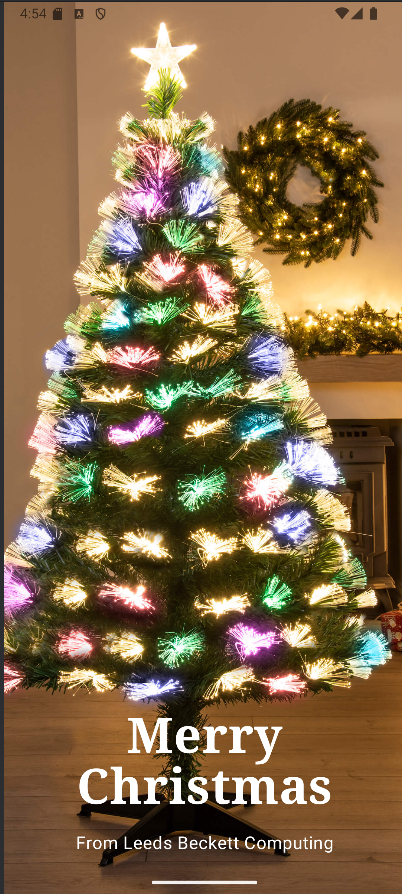
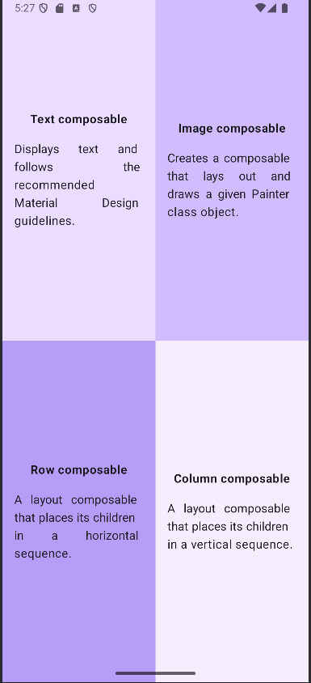
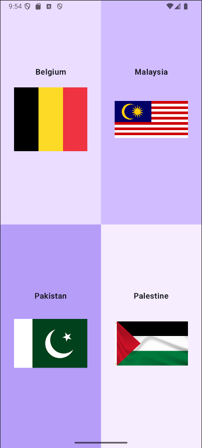
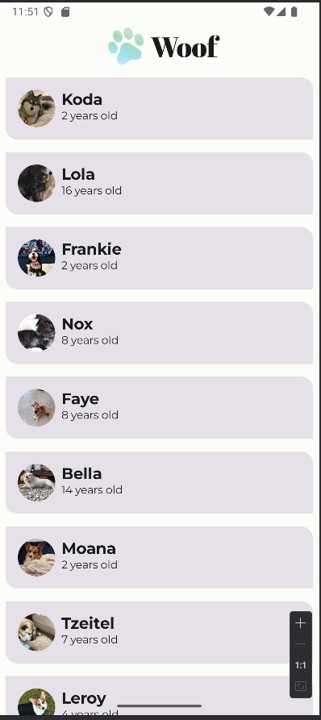
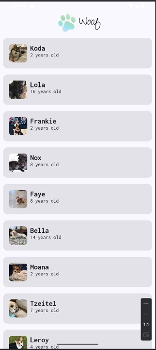
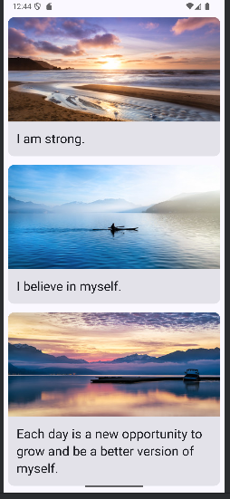

# Programming Portfolio - First Set of Exercises

*Please complete this document to confirm the work that has been done. You will also add your answers to the provided 
questions in the space provided*

Please replace ${\color{green}-- todo}$ with ${\color{blue}-- completed}$ once done.\
\
Include an appropriate screenshot from your application to confirm completion. Screenshots should be added to 
the /images folder in the top-level repo.\
\
Include the provided question for your exercise and your answer in the space provided.

---

### Happy Birthday ###

| **First Part ${\color{blue}-- completed}$** |     **Extension ${\color{blue}-- completed}$**     |
|:-------------------------------------------:|:--------------------------------------------------:|
|   |  |

#### Question ####
> *Please copy from the feedback branch when provided*
>  
>  
>  

#### Answer ####
> *Please provide your answer in this space*
> 
> 
> 
> 

---
### Quadrants ###

|     **First Part ${\color{blue}-- completed}$**     |     **Extension ${\color{blue}-- completed}$**      |
|:---------------------------------------------------:|:---------------------------------------------------:|
|  |  |

#### Question ####
> *Please copy from the feedback branch when provided*
>  
>  
>  

#### Answer ####
> *Please provide your answer in this space*
> 
> 
> 
> 

---

### Woof ###

| **First Part ${\color{blue}-- completed}$** |    **Extension ${\color{blue}-- completed}$**     |
|:-------------------------------------------:|:-------------------------------------------------:|
|            |  |

#### Question ####
> *Please copy from the feedback branch when provided*
>  
>  
>  

#### Answer ####
> *Please provide your answer in this space*
> 
> 
> 
> 

---

### Affirmations ###

|        **First Part ${\color{blue}-- completed}$**         |     **Extension ${\color{green}-- todo}$**      |
|:----------------------------------------------------------:|:-----------------------------------------------:|
|  |  |

#### Question ####
> *Please copy from the feedback branch when provided*
>  
>  
>  

#### Answer ####
> *Please provide your answer in this space*
> 
> 
> 
> 

---

