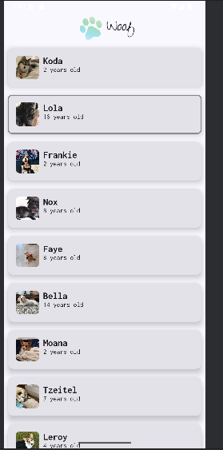
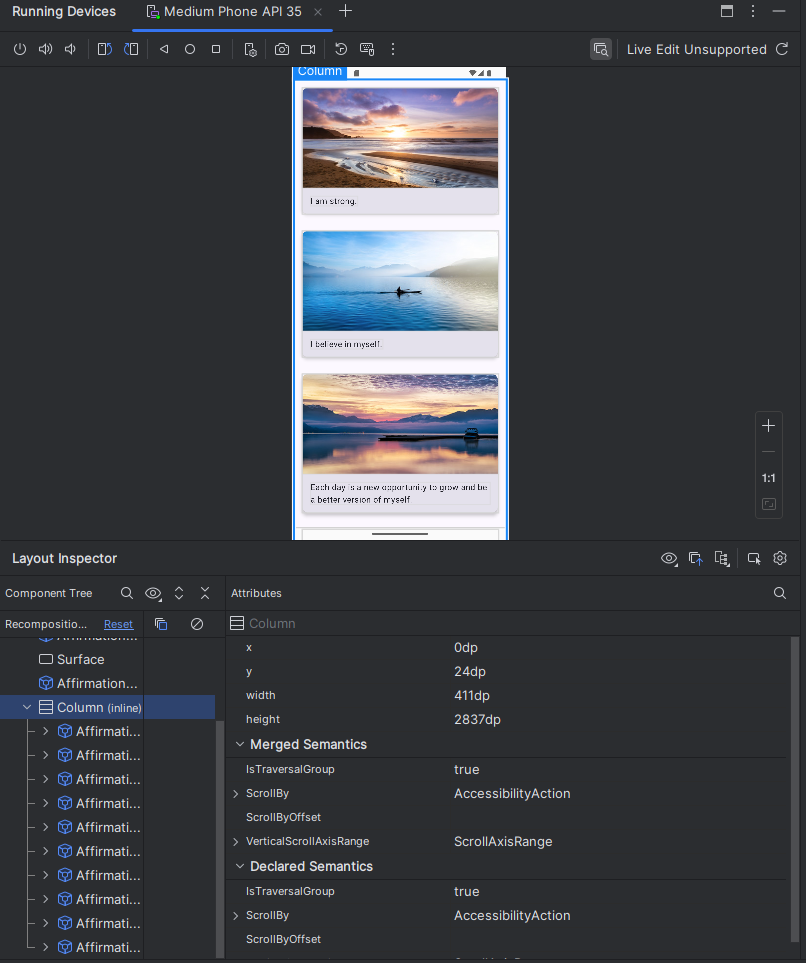

# Programming Portfolio - First Set of Exercises

*Please complete this document to confirm the work that has been done. You will also add your answers to the provided 
questions in the space provided*

Please replace ${\color{green}-- todo}$ with ${\color{blue}-- completed}$ once done.\
\
Include an appropriate screenshot from your application to confirm completion. Screenshots should be added to 
the /images folder in the top-level repo.\
\
Include the provided question for your exercise and your answer in the space provided.

---

### Happy Birthday ###

| **First Part ${\color{blue}-- completed}$** |     **Extension ${\color{blue}-- completed}$**     |
|:-------------------------------------------:|:--------------------------------------------------:|
|   |  |

#### Question ####
> *Please copy from the feedback branch when provided*
>  The Birthday/Christmas Example is localised to the English language. What changes would need to be done
> to make this app localised for the **Spanish** language.
>
> https://developer.android.com/guide/topics/resources/localization
>
> How would you test that your localised app worked as expected on the emulator?
> 
>
> Please include a screenshot of the new version working as part of the answer.
>
> My own example with German language translation is shown below.
> A screenshot of my french translation is shown below.
>
>  
>
> Make sure to add a final commit to your birthday branch with the amended code.

>  
>  

#### Answer ####
> *Please provide your answer in this space*
> How would you test that your localised app worked as expected on the emulator?
> - by changing the device language settings to french
> 
> 
> 

---
### Quadrants ###

|     **First Part ${\color{blue}-- completed}$**     |     **Extension ${\color{blue}-- completed}$**      |
|:---------------------------------------------------:|:---------------------------------------------------:|
|  |  |

#### Question ####
> *Please copy from the feedback branch when provided*
>  In the quadrants exercise, the layout of 2x2 has no issues on an orientation change.
> However, consider the impact a 3x2 in portrait would have when orientated.
> Is the preference for it to remain 3x2?
>
> Typically, layouts *adapt* to meet user expectations.
>
>  
>
> For this question, please provide an answer indicating how this would be done using *Composables*.
> You should include in the answer the specific code elements that are aware of the device orientation.
> A good place to start is **androidx.compose.ui.platform**
>
> To further demonstrate your knowledge of the answer - include a screenshot of a modified version
> of your quadrants to handle a 3x2 to 2x3 switch. Add as a final commit to your quadrants branch
>  
>  

#### Answer ####
> *Please provide your answer in this space*
> 
> 
> 
> We can use the localconfiguration.current to get the current orientation for the device. This is
> from the androidx.compose.ui.platform package. The value "islandscape" is then used to determine 
> configuration is in landscape. 
> 

---

### Woof ###

| **First Part ${\color{blue}-- completed}$** |    **Extension ${\color{blue}-- completed}$**     |
|:-------------------------------------------:|:-------------------------------------------------:|
|            |  |

#### Question ####
> *Please copy from the feedback branch when provided*
>  
>  Woof displays a list of Cards. The Material 3 API offers several card definitions.

https://developer.android.com/reference/kotlin/androidx/compose/material3/package-summary

Having looked at this documentation, please list the changes that will need to be made to produce the following effect on a card - a pressed state that removes a dropped shadow. See the screenshot, this shows an elevated default state with a raised shadow and a pressed state with no elevation.

woof interaction

While this type of material change is the default behaviour for a Pressed State, how could this be overriden so that a border is added on the Pressed state.

woof custom_interaction

Useful information can be found at:

https://developer.android.com/develop/ui/compose/touch-input/user-interactions/handling-interactions

Please add an additional commit to your woof branch and include a screenshot similar to the one shown. Please note the the colour of your card is unimportant and you should just use the card colours that you currently have in your project.

>  

#### Answer ####
> *Please provide your answer in this space*
> 
> 
> 
> By using card elevation, it can add a shadow to the card
> using .border can add a border to the card
> using a ".clickable", it will allow the card to become a clickable item and can be used to toggle the state
> 

---

### Affirmations ###

|        **First Part ${\color{blue}-- completed}$**         |       **Extension ${\color{blue}-- completed}$**        |
|:----------------------------------------------------------:|:-------------------------------------------------------:|
|  | , using a layout such as Column can cause performance issues, since all the items will be composed and laid out whether or not they are visible.”

Using the LayoutInspector tool and the Affirmation example further explain the above statement. It is expected that your included answer will include a screenshot from the LayoutInspector tool that shows the issue with using Column rather than LazyColumn for long lists.

Layout Inspector is a tool inside of Android Studio that will show live views from the emulator

https://developer.android.com/studio/debug/layout-inspector

HINT: You will need to change the composable for the Affirmation example to:

affirmation_column_code
>  
>  

#### Answer ####
> *Please provide your answer in this space*
> 
> Column is a basic composable. It is not efficient when there are large lists to show. LazyColumn 
> is more efficient, as it will only generate the  items that need to be visible. Using LazyColumn, 
> the items will be unloaded and loaded, as the user scrolls.
> 
> 

---

