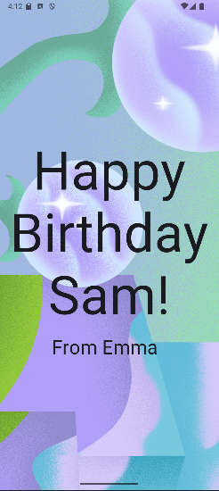

# Programming Portfolio - First Set of Exercises

*Please complete this document to confirm the work that has been done. You will also add your answers to the provided 
questions in the space provided*

Please replace ${\color{green}-- todo}$ with ${\color{blue}-- completed}$ once done.\
\
Include an appropriate screenshot from your application to confirm completion. Screenshots should be added to 
the /images folder in the top-level repo.\
\
Include the provided question for your exercise and your answer in the space provided.

---

### Happy Birthday ###

| **First Part ${\color{blue}-- completed}$** |     **Extension ${\color{blue}-- completed}$**     |
|:-------------------------------------------:|:--------------------------------------------------:|
|   |  |

#### Question ####
> *Please copy from the feedback branch when provided*
>  The Birthday/Christmas Example is localised to the English language. What changes would need to be done
> to make this app localised for the **Spanish** language.
>
> https://developer.android.com/guide/topics/resources/localization
>
> How would you test that your localised app worked as expected on the emulator?
> 
>
> Please include a screenshot of the new version working as part of the answer.
>
> My own example with German language translation is shown below.
> A screenshot of my french translation is shown below.
>
>  
>
> Make sure to add a final commit to your birthday branch with the amended code.

>  
>  

#### Answer ####
> *Please provide your answer in this space*
> How would you test that your localised app worked as expected on the emulator?
> - by changing the device language settings to french
> 
> 
> 

---
### Quadrants ###

|     **First Part ${\color{blue}-- completed}$**     |     **Extension ${\color{blue}-- completed}$**      |
|:---------------------------------------------------:|:---------------------------------------------------:|
|  |  |

#### Question ####
> *Please copy from the feedback branch when provided*
>  In the quadrants exercise, the layout of 2x2 has no issues on an orientation change.
> However, consider the impact a 3x2 in portrait would have when orientated.
> Is the preference for it to remain 3x2?
>
> Typically, layouts *adapt* to meet user expectations.
>
>  
>
> For this question, please provide an answer indicating how this would be done using *Composables*.
> You should include in the answer the specific code elements that are aware of the device orientation.
> A good place to start is **androidx.compose.ui.platform**
>
> To further demonstrate your knowledge of the answer - include a screenshot of a modified version
> of your quadrants to handle a 3x2 to 2x3 switch. Add as a final commit to your quadrants branch
>  
>  

#### Answer ####
> *Please provide your answer in this space*
> 
> 
> 
> We can use the localconfiguration.current to get the current orientation for the device. This is
> from the androidx.compose.ui.platform package. The value "islandscape" is then used to determine 
> configuration is in landscape. 
> 

---

### Woof ###

| **First Part ${\color{blue}-- completed}$** |    **Extension ${\color{blue}-- completed}$**     |
|:-------------------------------------------:|:-------------------------------------------------:|
|            |  |

#### Question ####
> *Please copy from the feedback branch when provided*
>  
>  
>  

#### Answer ####
> *Please provide your answer in this space*
> 
> 
> 
> 

---

### Affirmations ###

|        **First Part ${\color{blue}-- completed}$**         |       **Extension ${\color{blue}-- completed}$**        |
|:----------------------------------------------------------:|:-------------------------------------------------------:|
|  | ![affirmation part 2](./images/AffirmationExtension.png |

#### Question ####
> *Please copy from the feedback branch when provided*
>  
>  
>  

#### Answer ####
> *Please provide your answer in this space*
> 
> 
> 
> 

---

