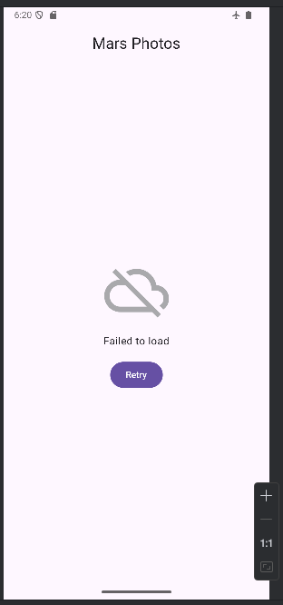

# Programming Portfolio - Second Set of Exercises

*Please complete this document to confirm the work that has been done. You will also add your answers to the provided 
questions in the space provided*

Please replace ${\color{green}-- todo}$ with ${\color{blue}-- completed}$ once done.\
\
Include an appropriate screenshot from your application to confirm completion. Screenshots should be added to 
the /images folder in the top-level repo.\
\
Include the provided question for your exercise and your answer in the space provided.

---

### Cupcake ###

|                                                                         **First Part ${\color{blue}-- completed}$**                                                                         |                             **Extension ${\color{blue}-- completed}$**                              |
|:-------------------------------------------------------------------------------------------------------------------------------------------------------------------------------------------:|:---------------------------------------------------------------------------------------------------:|
|     |   |

#### Question ####
> *Please copy from the feedback branch when provided*
>  In the CupCake example, a NavHostController object is used. 
> This allows the popBackStack method to be called. 
> Which class does the NavHostController extend that contains the popBackStack() method?

> Which other method(s) in this parent class is/are used to move between the other screens in the Cupcake example? 
> How are these used - please make reference to the code and not just the visual output?
>  

#### Answer ####
> *Please provide your answer in this space*
> >  NavHostController extends the NavController class, which contains the popBackStack method.
The cupcake example uses the navController.navigate() method to move between screens.

> composable(route = CupcakeScreen.Start.name) {
> StartOrderScreen(
> quantityOptions = DataSource.quantityOptions,
> onNextButtonClicked = {
> viewModel.setQuantity(it)
> navController.navigate(CupcakeScreen.Flavor.name)
> },

> This method is used within the StartOrderScreen composable. The user presses the next button, which sets the quantity in the
> OrderViewModel using "viewModelsetQuantity(it)". Then, navController.navigate() is called and the name of the next screen is passed to the navigate
> method. This causes the navigation to move forward.

> Similarly, the cancel button also uses the popBackStack() method to take the user back to the start screen.

---
### DiceRoller ###

|    **First Part ${\color{blue}-- completed}$**    |                            **Extension ${\color{blue}-- completed}$**                            |
|:-------------------------------------------------:|:------------------------------------------------------------------------------------------------:|
|  |   |

#### Question ####
> *Please copy from the feedback branch when provided*
>  onCreate is passed a parameter (savedInstanceState: Bundle?). W
> What is this? What value will it have on first run. Please evidence this value with the use of the debugger and an appropriate screenshot.

> What may cause this Bundle to change in DiceRoller?

> In your own implementation of DiceRoller, are you using this Bundle in anyway. 
> Please note that depending on how you have approached DiceRoller will determine the correct response to this section.
>  
>  

#### Answer ####
> *Please provide your answer in this space*
> SavedInstanceStateis a bundle object that contains the saved state of the activity. It is passed to
> onCreate when the activity needs to be restored after it has been destroyed. The value that it has 
> on first run is null, as there is no state that exists. This was evidenced by using logcat to output 
> the value of the variable "$savedInstanceState".
> 
> 
> 

---

### DessertClicker ###

|                            **First Part ${\color{blue}-- completed}$**                            |                               **Extension ${\color{blue}-- completed}$**                                |
|:-------------------------------------------------------------------------------------------------:|:-------------------------------------------------------------------------------------------------------:|
|   |   |

#### Question ####
> *Please copy from the feedback branch when provided*
>  In completing the extension for DessertClicker you will have created a ViewModel class. 
> Why is a viewmodel class instance created with the first line shown below and not the second?

> val viewModel: DessertViewModel = viewModel()

> val viewModel: DessertViewModel = DessertViewModel()

> How might this understanding be evidenced through the use of the debugger. Please include a screenshot.

> What design patterns are being used here.

> (Please note that if you have not completed the extension to DessertClicker - you can use MarsPhoto ViewModel as the case study for the question)
>  
>  

#### Answer ####
> *Please provide your answer in this space*
> The first line uses the viewModel() function, which is provided by the androidx.lifecycle library.
> This function automatically handles the lifecycle, allowing the viewmodel to be reused even when there are changes such as screen rotations.
> The second line manually creates a viewmodel. 
> This still works but it does not handle the lifecycle in the way that the first line does. 
> This means that, if the activity is destroyed, a fresh instance of the DessertViewModel would be created, and the state would be lost.
> 
> In the first debugger screenshot, the constructor is stopped at when the activity is created. The constructor is not stopped at again in the second 
> screenshot, which confirms that the same viewmodel instance is being reused. This would not happen if the second line was used.
>
    

---

### MarsPhoto ###

| **First Part ${\color{blue}-- completed}$**  |                        **Extension ${\color{blue}-- completed}$**                         |
|:--------------------------------------------:|:-----------------------------------------------------------------------------------------:|
|  |    |

#### Question ####
> *Please copy from the feedback branch when provided*
>  In MarsPhoto an external API is used to populate the application. This required a change to the manifest file to allow this to happen. 
> What change was this?

> If this change was not there, what would be the implication when the app was run? 
> Please indicate as part of the answer the exception that is thrown by including a screenshot from the Logcat window.

> Finally as part of this question – the manifest file will have an IntentFilter applied to an Activity. 
> In the MarsPhoto, this would be:

> // <intent-filter>

> // <action android:name="android.intent.action.MAIN" />
> // <category android:name="android.intent.category.LAUNCHER" />

> // </intent-filter >

> Please expand on the purpose of this
>  
>  

#### Answer ####
> *Please provide your answer in this space*
> 
> To allow the application to access the external api, the following line was added to the AndroidManifest.xml file.
> "<uses-permission android:name="android.permission.INTERNET" />"
> This permission is not set by default due to security concerns. It is required for any app that needs to connect to a network.
> If this change is not made, the mars app will still build and run but any network requests that are sent will fail, so the pictures will not be displayed as they are fetched from an API.
> An exception will also be thrown as shown in the following screenshot.

> 
>
> In AndroidManifest.xml, the intent filter is used to state how the app can be started.
> The "<action android:name="android.intent.action.MAIN" />" is used to mark the entry point of the application
> The "<category android:name="android.intent.category.LAUNCHER" />" is used to ensure that the app appears on the home screen.
> This intent filter allows the app to be launched from the screen. If the app didnt have this, it would still install
> but it would not open via the home screen. 
> 
> 
> 
> 
---

